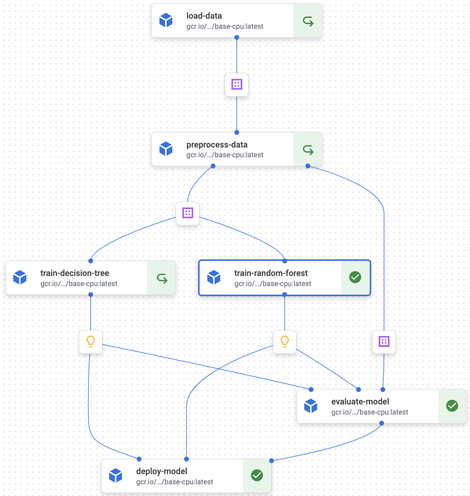
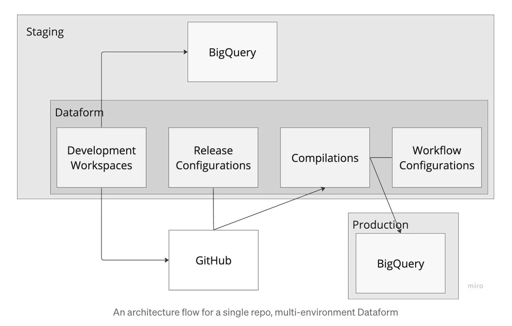
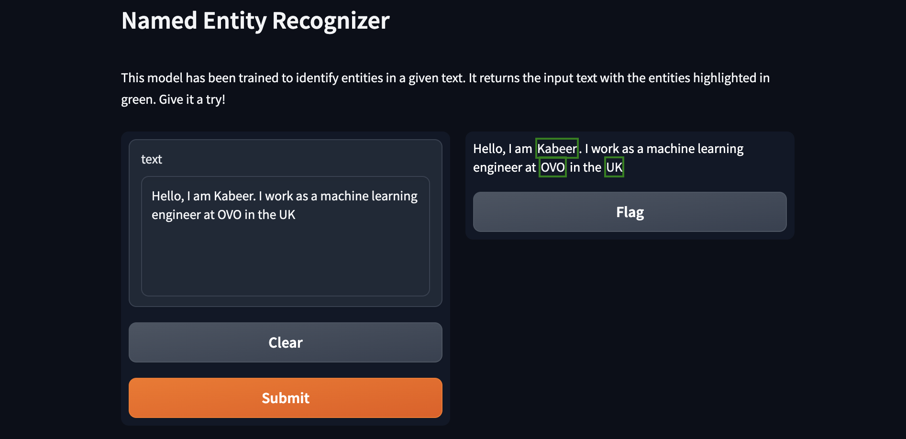

# Hiya! 👋

My name is **Kabeer Akande**, and I'm a senior machine learning engineer at [**OVO**](https://www.ovoenergy.com/)!

- 💛 I love productionising ML products and building scalable ML pipelines
- 🔭 Formerly at [**BigDEAL**](https://www1.uwe.ac.uk/bl/research/big-deal.aspx), [**S2DS**](http://www.s2ds.org/), [**MindfulChef**](https://www.mindfulchef.com/), and [**UOE**](https://www.eng.ed.ac.uk/)

<!--  -->

## 🚀 (Some) highlights
- Built MLOPS platforms with Airflow and Vertex AI pipelines [**@OVO**](https://www.ovoenergy.com/)
- Built Alexa-type chatbot (Conversational-BIM) with AWS [**@BigDEAL**](https://www1.uwe.ac.uk/bl/research/big-deal.aspx)
- Developed a personalised recommender system (Digital Waiter) [**@Mindful Chef**](https://www.mindfulchef.com/)
- Innovations led to three granted [**US patents**](https://uspto.report/company/Akande-Kabiru) and over 50 peer-reviewed [**publications**](https://scholar.google.co.uk/citations?user=PiWvuqYAAAAJ&hl=en)
- Hold  [**GCP ML Engineer**](https://www.credential.net/cf4c85e8-6e3b-4791-8ed5-8ad20af8f841?key=692460154c57397d4e6268c41719c602a87fa98011d70b86adf7570070660436) and [**HashiCorp Terraform Associate (003)**](https://www.credly.com/badges/eacd21df-2f7a-4690-bc69-7d90b5301343/public_url) certifications
- Endorsed by [Royal Academy of Engineering](https://raeng.org.uk/programmes-and-prizes/programmes/international-programmes/global-talent-visa) as UK Promising Talent
- My team won the most innovative prize at 2019 [**S2DS**](https://www.s2ds.org/) programme 
- [Grant](https://icc2018.ieee-icc.org/authors/student-travel-grants.html#comsoc) winner at COMSOC IEEE ICC 2018 US conference
- Technical volunteer at [codeyourfuture](https://codeyourfuture.io/)

## 🚢 Open source projects

### [MLOPS Platform](https://github.com/kbakande/MLOPS-Platform) 

`MLOPS_Platform` is a robust machine learning platform designed to streamline ML workflows on Google Cloud Platform (GCP) resources. Following best practices in MLOps and DevOps, it offers a structured and efficient approach to managing data loading, preprocessing, model training, evaluation, and deployment. It features automated scaling, testing, integration, documentation, and deployment. If you want to find out more, I have published a development roadmap on my [Medium](https://towardsdatascience.com/extensible-and-customisable-vertex-ai-mlops-platform-a2c146d13186) page. 

   #### Pipeline Visualization

   Below is a visualization of the MLOPS Platform pipeline components as executed on Vertex AI:

   

### [Terraforming Dataform](https://github.com/kbakande/terraforming-dataform) 
`Terraforming Dataform` establishes the fundamentals of a single repo, multi-environment Dataform with least-privilege access control and infrastructure as code setup. Datailed explanation of the workflow is published on my [Medium](https://towardsdatascience.com/understanding-dataform-terminologies-and-authentication-flow-aa98c2fbcdfb) page.
  
  #### Architecture
   
   

### [Machine Learning Models as Product (MLMaP)](https://github.com/kbakande/pet-adoption-classifier) 

`MLMaP` is a paradigm shift in ML modelling. It demonstrates building ML algorithms as software products thus, enabling data scientists and ML engineers to package models similar to how software developers and engineers ship software applications. It is a step towards MLOps implementation. 

### [Named Entity Recognition App (NER)](https://github.com/kbakande/named-entity-recognition)
`NER` is a Named Entity Recognition (NER) application. The app is built using Hugging Face's Transformers and Gradio, allowing users to input text and receive identified named entities. It utilizes a fine-tuned BERT model (`koakande/bert-finetuned-ner`) for high-accuracy entity recognition. You can try it out on my [Hugging space](https://huggingface.co/spaces/koakande/named_entity_recognition)

   

## 🌍🛠 Languages and tools 

👨‍💻 Regularly using...

🎉 Delivered projects using...

📚 Learning with...

## 🧮 GitHub statistics

    
    

